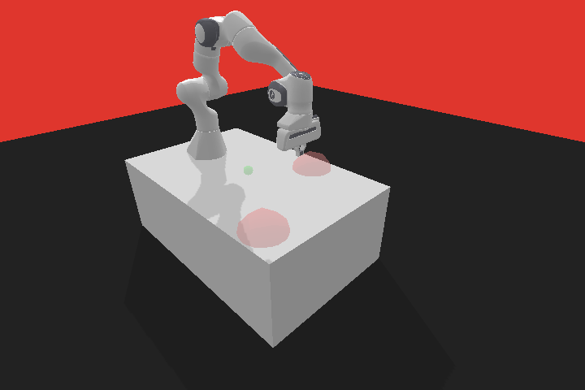
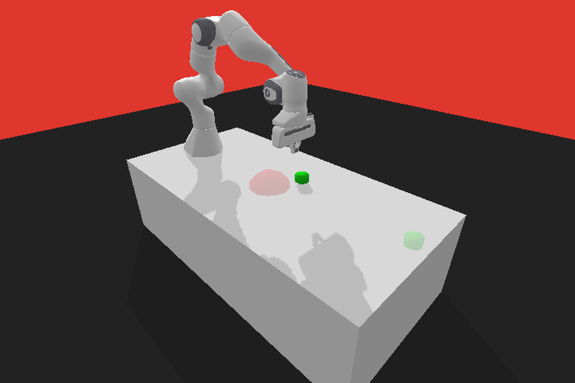
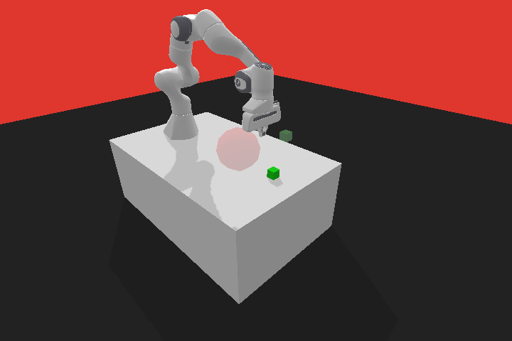
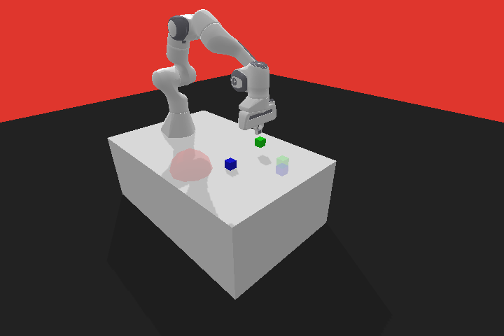
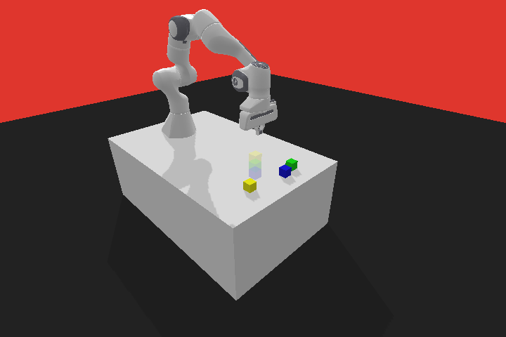
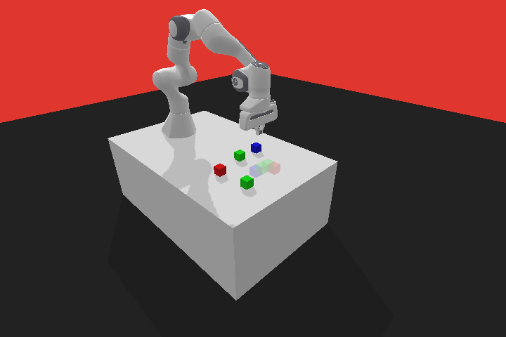

# Safe-Panda-gym
We develop a modification to the [Panda Gym](https://github.com/qgallouedec/panda-gym) by adding constraints to the environments like Unsafe regions and,
constraints on the task. The aim is to develop an environment to test CMDPs (Constraint Markov Decision Process) / Safe-RL algorithms
such as CPO, PPO - Lagrangian and algorithms developed by the team.

Safe-Panda-gym is developed with the following key features:

* Add safe environments considering the constraints, like `PandaReachSafe-v2`, `PandaPushSafe-v2`, `PandaSlideSafe-v2`, `PickAndPlaceSafe-v2` and `PandaStackSafe-v2`.
* Support image-based environments, which can be found in `rgb_rendering_safe.py` in the `test_safe_envs` folder.
* Support [SafePO-Baselines](https://github.com/PKU-MARL/Safe-Policy-Optimization) to train the safe environments in our repo, which can be seen in the `train_safe_rl_algorithms` folder.


Safe-Panda-Gym is a project maintained by 
[Tosin](https://github.com/tohsin) and [Shengjie Wang](https://github.com/Shengjiewang-Jason).
We encourage modifications and recommendations like new constraints, new environments, bug fixes, and Image-based observation environments intended to be used for Dreamer-v2 like Model-based algorithms.

##  Safe Multi Task env
We add environments intended to be used to learn multi-task or sub-goal RL, as some tasks build on another, and knowledge used to solve one can be transferable to another.

## Documentation

Check out the [documentation](https://panda-gym.readthedocs.io/en/latest/) in [Panda Gym](https://github.com/qgallouedec/panda-gym).

## Installation

## Add Safe Rl submodule
git submodule add .git

### From source

```bash
git clone https://github.com/tohsin/Safe-panda-gym.git
pip install -e .
```

## Usage

```python
import gym
import panda_gym
import time
env = gym.make("PandaReachSafe-v2", render=True)
obs_dim = env.observation_space.shape

obs = env.reset()
done = False

while not done:
    action = env.action_space.sample()
    obs, reward, done, info = env.step(action)
    cost = info['cost']
    env.render(mode='human')
    print(cost)
    time.sleep(2)


env.close()
```
More testing examples can be found in the `test_safe_env` folder.


## Safe Environments
|                                  |                                                |
| :------------------------------: | :--------------------------------------------: |
|         `PandaReachSafe-v2`          |              `PandaPushSafe-v2`                    |
|  |  |
|         `PandaSlideSafe-v2`          |              `PickAndPlaceSafe-v2`                    |
|  |  |
|         `PandaStackSafe-v2`          
|  


## Extra Environments by the Team

|                                  |                                                |
| :------------------------------: | :--------------------------------------------: |
|         `PandaStack3-v2`          |              `PandaStackPyramid-v2`                    |
|  |  |
|         `PandaBuildL-v2`          
|  


## Baselines results

Baselines results are obtained by [SafePO](https://github.com/PKU-MARL/Safe-Policy-Optimization).

## Citation

If you think the bechmark is useful, please cite as

```bib

@misc{SafePandaGym,
  author = {Tosin Oseni, Shengjie Wang},
  title = {Safe Panda Gym},
  year = {2022},
  publisher = {GitHub},
  journal = {GitHub repository},
  howpublished = {\url{https://github.com/tohsin/Safe-panda-gym}},
}

@article{gallouedec2021pandagym,
  title        = {{panda-gym: Open-Source Goal-Conditioned Environments for Robotic Learning}},
  author       = {Gallou{\'e}dec, Quentin and Cazin, Nicolas and Dellandr{\'e}a, Emmanuel and Chen, Liming},
  year         = 2021,
  journal      = {4th Robot Learning Workshop: Self-Supervised and Lifelong Learning at NeurIPS},
}


```


